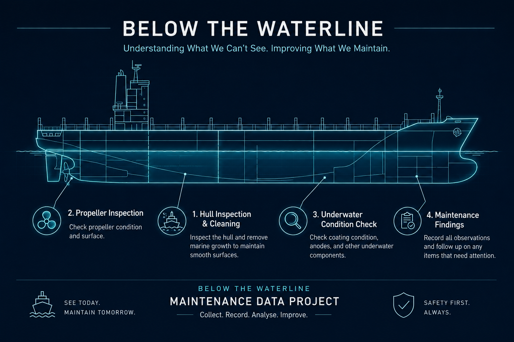

# ⚓ Below the Waterline — What Divers See Under a Ship

> **Ship looks clean from above.  
> But below water... different story already.** 😂

Ships spend a lot of time in seawater.

Over time, marine growth can build up underneath.

**Slime. Barnacles. Fouling.**

So I started wondering:

> ## **What does a diver actually see under a ship — and what can the data tell us?**

---

---

## 🌊 What's Down There?

Marine growth can appear around different underwater parts:

**🚢 Hull**

**⚙️ Propeller**

**🛞 Rudder**

**🌊 Sea chest**

Basically:

> **Ship already carrying cargo. Don't need barnacles also.** 😂

Most of us never see these parts.

**The diver does.**

---

## 🤿 So What Does the Diver Actually See?

From deck, everything may look okay.

Go underwater and maybe different story.

That's why inspection matters.

A simple job record might look like:

**Diver goes down → CCTV / inspect → Find the fouling → Clean if needed → Check again → Record**

Sometimes it could also include **propeller polishing** or checking other
underwater parts.

Now we have information we can study.

---

## 📊 What Can We Track?

Keep it simple:

**🚢 Vessel** — Which ship?

**📅 Last Cleaning** — How long ago?

**🌿 Growth** — What was found?

**📍 Location** — Where was it found?

**⏱️ Cleaning Time** — How long?

**🔍 Before & After** — What changed?

One job gives us one record.

**Many jobs can start showing us a pattern.**

---

## 🔍 What Can We Learn?

After enough records, we can ask:

**Does heavier growth take longer to clean?**

**Which underwater parts need attention most often?**

**What gets found during inspections?**

**Which vessels normally need more work?**

Don't anyhow guess lah. 😂

> **Check the records first.**

---

## 🔧 What If the Diver Finds Something Else?

Sometimes an inspection may find more than marine growth.

Maybe wear.

Maybe damage.

Maybe something that needs another look.

The finding gets recorded and the proper marine team decides what
happens next.

For this project, I'm interested in:

> **What was found? What changed? What can the records teach us?**

---

# 🧠 The Simple Idea

**Ship comes in → Diver goes down → Inspect → Clean → Check again → Record**

That's it.

> ## **Above water everything swee swee. Below water? Better check.** 😂

---

## 🐍 Python Version

[View `ship_husbandry_logic.py`](ship_husbandry_logic.py)

---

## ⚠️ Disclaimer

This is a learning and data project about underwater vessel maintenance.

Commercial diving is specialised work. This project looks at the data
from the work and is not a diving, cleaning or repair guide.

---

## ✍️ Credits

**Idea & analysis:** Wansaidon  
**Written with:** ChatGPT by OpenAI

---

> **Most people see the ship from above.**

***The diver sees the part we don't.*** 🤿